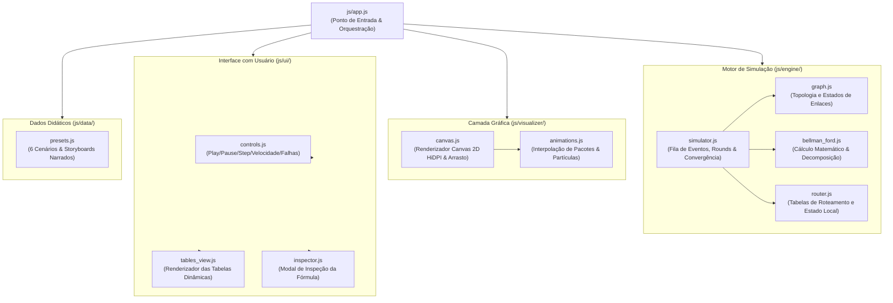

<div align="center">

# 🌐 Simulador Interativo de Vetores de Distância
### Bellman-Ford & Protocolo RIP (RFC 2453)
**Universidade Federal do Pará (UFPA) — Redes de Computadores II**

[](https://github.com/Daniloloureiro/simulador-vetores-distancia)
[](LICENSE)
[](js/)
[](index.html)
[](tests/)
[](https://www.ufpa.br)

<br/>

> **Uma plataforma educacional interativa de alto impacto visual para aprendizado, experimentação matemática e demonstração do algoritmo de Vetor de Distâncias, loops de roteamento e técnicas de mitigação.**

[Recursos Principais](#-recursos-principais) •
[Cenários Didáticos](#-cenários-didáticos-inclusos) •
[Roteiro de Apresentação](#-roteiro-para-apresentação-oral-10-min) •
[Arquitetura](#-arquitetura-do-projeto) •
[Como Executar](#-como-executar) •
[Autor](#-autor--créditos)

---

</div>

## 📌 Contexto & Propósito Acadêmico

Este simulador foi concebido e desenvolvido para a disciplina de **Redes de Computadores II** na **Universidade Federal do Pará (UFPA)**. O objetivo é superar a abstração teórica comumente associada ao ensino de algoritmos de roteamento, permitindo que estudantes e professores:

1. **Visualizem fisicamente** a troca assíncrona de vetores de distância através de pacotes animados trafegando pelos enlaces.
2. **Inspecionem passo a passo a matemática** por trás de cada decisão de roteamento conforme a equação canônica de **Bellman-Ford**.
3. **Provoquem falhas dinâmicas** (corte de cabos e alteração de métricas) em tempo real.
4. **Vivenciem o problema da Contagem até o Infinito (*Count-to-Infinity*)** e compreendam a eficácia imediata do **Split Horizon com Poisoned Reverse** (técnica padrão do protocolo RIP).

---

## ✨ Recursos Principais

### 🎮 Topologia e Física Interativa (Canvas 60 FPS)
* **Arrasto Livre (*Drag & Drop*)**: reposicione roteadores em tempo real para organizar a visualização como preferir.
* **Simulação de Falha de Cabo**: dê um clique sobre qualquer enlace para simular o rompimento físico da fibra/cabo (o enlace fica tracejado em vermelho com indicador `✕`).
* **Edição Dinâmica de Métricas**: use `Shift + Clique` no enlace para alterar o custo da rota e acompanhar a reação dos roteadores.
* **Criação de Topologias**: botões integrados para inserir nós adicionais e conectar novos enlaces sob demanda.

### 📦 Motor de Animação e Partículas
* Pacotes circulares trafegam suavemente pelos cabos com selos indicando o vetor transmitido `[Destino: Custo]`.
* Sistema de partículas e anéis de impacto sonoro/visual disparam no momento em que um roteador processa novas tabelas.

### 📊 Tabelas de Roteamento em Tempo Real
* Visualização lado a lado de todos os nós: **Destino**, **Métrica (Custo)** e **Próximo Salto (*Next Hop*)**.
* Feedback cromático inteligente:
  * 🟢 **Verde**: rotas atualizadas ou otimizadas no último round.
  * 🔴 **Vermelho**: rotas inalcançáveis marcadas com $\infty$ (métrica 16).
  * 🟡 **Amarelo**: enlace sob falha ou transição de estado.

### 🔬 Inspetor Matemático de Bellman-Ford
* Ao clicar em qualquer nó ou linha de tabela, abre-se o modal de inspeção que decompõe detalhadamente a equação:
  $$\mathbf{D_x(y) = \min_v \Big\{ c(x, v) + D_v(y) \Big\}}$$
* Tabela comparativa com cada vizinho $v$, custo direto $c(x, v)$, métrica anunciada $D_v(y)$, soma calculada e indicação explícita do menor caminho selecionado.

### 🎙️ Modo Apresentação com Storyboards Narrados
* Narrador integrado com explicações prontas em português para cada etapa da aula/apresentação.
* Controles multimídia: **Tocar Demonstração**, **Avançar Etapa**, **Voltar**, **Pausar** e seletor de velocidade ($0.5\times$ a $3\times$).

---

## 🎬 Cenários Didáticos Inclusos

O simulador vem equipado de fábrica com **6 cenários pré-configurados**:

| # | Cenário | Descrição Didática |
|---|---|---|
| **1** | **Convergência Básica (Triângulo A-B-C)** | Demonstração do cálculo de Bellman-Ford e escolha de caminho indireto ($A \to B \to C$ com custo 3 em vez da rota direta de custo 5). |
| **2** | **Contagem até o Infinito (*Count-to-Infinity*)** | Simulação sem mitigação da queda do enlace $B-C$. Os roteadores $A$ e $B$ criam um loop de ilusão mútua onde a métrica sobe gradualmente até atingir 16. |
| **3** | **Solução com Poisoned Reverse** | Mesma topologia e falha do Cenário 2, mas com o *Envenenamento Reverso* ativado. O nó $A$ avisa $B$ que $D_A(C) = \infty$, eliminando o loop em **apenas 1 rodada**. |
| **4** | **Roteamento Dinâmico em Malha** | Rede com redundância que desvia o tráfego para caminhos secundários em caso de falha e reconverge automaticamente quando o enlace é restaurado. |
| **5** | **Exemplo Canônico de Kurose & Ross** | A topologia clássica de 6 nós apresentada no livro *Redes de Computadores e a Internet: Uma Abordagem Top-Down* (Capítulo 5). |
| **6** | **Rede do Campus Universitário UFPA (Belém)** | Topologia temática representando o campus da UFPA: **Reitoria**, **Setor Básico**, **Setor Profissional**, **Mirante do Rio** e **Datacenter/CTIC**. |

---

## 🧠 Fundamentação Teórica

### 1. A Equação de Bellman-Ford
No protocolo RIP e na família de algoritmos por vetor de distâncias, cada nó $x$ envia periodicamente cópias de suas estimativas de menor custo para todos os seus vizinhos $v \in \text{Vizinhos}(x)$.

Quando $x$ recebe o vetor de distâncias $D_v$ de um vizinho $v$, ele atualiza seu próprio vetor aplicando a relação de Bellman-Ford:

$$D_x(y) = \min_{v} \Big\{ c(x, v) + D_v(y) \Big\}, \quad \forall y \in N$$

### 2. O Problema da Contagem até o Infinito
> *"Boas notícias viajam rápido; más notícias viajam devagar."*

Considere a topologia linear $A \overset{1}{\longleftrightarrow} B \overset{1}{\longleftrightarrow} C$:
1. Em regime normal, $B$ alcança $C$ com custo $1$, e $A$ alcança $C$ via $B$ com custo $2$.
2. Quando o enlace $B-C$ é rompido, $B$ perde a rota direta para $C$.
3. Entretanto, $A$ havia anunciado anteriormente que alcançava $C$ com custo $2$.
4. Sem mecanismos de mitigação, $B$ assume erroneamente: *"Posso alcançar $C$ passando por $A$, com custo $c(B,A) + D_A(C) = 1 + 2 = 3$!"*.
5. Na iteração seguinte, $A$ descobre que $B$ subiu o custo para 3 e calcula: $1 + 3 = 4$.
6. Esse ciclo vicioso repete-se indefinidamente ($3 \to 4 \to 5 \to \dots \to 16$) até que o teto de infinito ($\infty = 16$ no RIP) seja alcançado, desperdiçando ciclos de CPU e causando descarte massivo de pacotes em trânsito.

### 3. Técnicas de Mitigação no RIP

```mermaid
flowchart LR
    subgraph SemMitigacao["Sem Mitigação"]
        direction TB
        S1["A anuncia D_A(C) = 2 para B"] --> S2["B-C cai"]
        S2 --> S3["B usa A: custo 3"]
        S3 --> S4["Loop infinito até 16"]
    end

    subgraph ComPoison["Com Poisoned Reverse"]
        direction TB
        P1["Como A vai a C via B,<br/>A mente para B: D_A(C) = ∞"] --> P2["B-C cai"]
        P2 --> P3["B calcula: c(B,A) + ∞ = ∞"]
        P3 --> P4["Rota marcada como inalcançável<br/>em apenas 1 rodada!"]
    end

    style SemMitigacao fill:#3b1111,stroke:#e74c3c,stroke-width:2px
    style ComPoison fill:#0f381e,stroke:#2ecc71,stroke-width:2px
```



* **Split Horizon (Horizonte Dividido)**: impede que um roteador anuncie uma rota de volta pela mesma interface pela qual ela foi aprendida.
* **Poisoned Reverse (Envenenamento Reverso)**: além de omitir a rota, o roteador anuncia ativamente a distância para o destino como **$\infty$ (16)** para o vizinho que é o seu próprio *Next Hop*.

---

## 🎤 Roteiro para Apresentação Oral (10 min)

Guia passo a passo pronto para ser utilizado em sala de aula perante o professor e colegas:

```
[00:00 - 01:30] INTRODUÇÃO & OBJETIVOS
• "Boa noite a todos. Nosso projeto é um simulador interativo voltado ao estudo
  do algoritmo de Vetores de Distância, Bellman-Ford e o protocolo RIP."
• Projetar a tela inicial e destacar a interface com Canvas a 60 FPS e as tabelas
  de roteamento dinâmicas.

[01:30 - 03:30] DEMONSTRAÇÃO 1: CONVERGÊNCIA BÁSICA
• Carregar o "Cenário 1: Convergência Básica (Triângulo)".
• Clicar em "⏭ Avançar 1 Passo": mostrar os pacotes coloridos trafegando pelos cabos.
• Explicar a tabela do nó A: mesmo tendo enlace direto para C com custo 5,
  ele aprende via B a rota com custo 3 (1 + 2).
• Abrir o "Inspetor Matemático" e exibir a comparação da equação no modal.

[03:30 - 06:00] DEMONSTRAÇÃO 2: CONTAGEM ATÉ O INFINITO (O Ponto Crítico)
• Carregar o "Cenário 2: Contagem até o Infinito".
• Simular a falha: clicar no botão vermelho "⚡ Simular Queda do Enlace B — C".
• Avançar os passos em velocidade 1x e acompanhar a tabela:
  "Vejam os custos subindo: 3, 4, 5, 6... 16."
• Explicar a ilusão de roteamento: B acha que A chega a C, e A acha que B chega a C.

[06:00 - 08:00] DEMONSTRAÇÃO 3: POISONED REVERSE EM AÇÃO
• Carregar o "Cenário 3: Solução com Poisoned Reverse".
• Destacar que agora o Poisoned Reverse está ativo.
• Provocar novamente a queda do cabo B — C.
• Avançar 1 único passo: B reconhece instantaneamente a métrica ∞ via A.
• Concluir: o loop que levou 15 iterações no Cenário 2 foi resolvido em 1 rodada.

[08:00 - 10:00] TOPOLOGIA UFPA & CONCLUSÃO
• Carregar o "Cenário 6: Rede do Campus UFPA".
• Demonstrar o arrasto de roteadores e a resiliência da malha universitária.
• Abrir para dúvidas e considerações do professor.
```

---

## 🏗️ Arquitetura do Projeto

O simulador foi concebido seguindo princípios de arquitetura modular, com separação estrita entre motor matemático, camada de renderização gráfica e interface:



---

## 🚀 Como Executar

O projeto utiliza **JavaScript puro (ES6 Modules)** e não requer compilação, bundlers ou instalação de dependências pesadas (`node_modules`).

### Método 1: Direto no Navegador (Zero Configuração)
Basta clonar o repositório e abrir o arquivo [`index.html`](file:///home/eclipse/Documents/UFPA/Redes%20II/index.html) em qualquer navegador moderno:

```bash
git clone https://github.com/Daniloloureiro/simulador-vetores-distancia.git
cd simulador-vetores-distancia
```
Abra o arquivo `index.html` com dois cliques ou com o comando:
```bash
xdg-open index.html # No Linux
open index.html     # No macOS
start index.html    # No Windows
```

### Método 2: Servidor Local (Recomendado para suporte completo a módulos ES6)
```bash
# Com Python 3:
python3 -m http.server 8080

# Ou com Node.js:
npx serve .
```
Acesse no seu navegador: **`http://localhost:8080`**.

---

## 🧪 Testes Automatizados

O repositório inclui uma suíte completa de testes automatizados formais em Node.js que valida matematicamente o algoritmo de Bellman-Ford, a contagem até o infinito e a integridade de todos os 6 presets:

```bash
# Executar a suíte completa de testes:
npm test
```

Saída esperada:
* ✅ **Teste 1**: Convergência formal do grafo em triângulo.
* ✅ **Teste 2**: Reprodução fidedigna das 15 rodadas da Contagem até o Infinito até o teto $\infty = 16$.
* ✅ **Teste 3**: Mitigação instantânea em 1 rodada com Poisoned Reverse.
* ✅ **Teste 4**: Roteamento dinâmico e reconvergência após reparo de cabo.
* ✅ **Validação dos Presets**: 100% dos nós, enlaces e etapas dos 6 storyboards validados.

---

## ⌨️ Atalhos & Controles Interativos

| Ação | Como Executar |
|---|---|
| **Mover Roteador** | Clique e arraste o nó pelo Canvas. |
| **Cortar / Restaurar Cabo** | Clique diretamente em cima de qualquer enlace. |
| **Editar Custo da Rota** | Pressione `Shift` + clique sobre o enlace. |
| **Inspecionar Matemática** | Clique em qualquer nó ou linha da tabela de roteamento. |
| **Passo a Passo** | Clique em `⏭ Avançar 1 Passo` no painel superior. |
| **Execução Contínua** | Clique em `▶ Executar Simulação` (ajuste a velocidade de $0.5\times$ a $3\times$). |
| **Trocar de Cenário** | Selecione qualquer uma das 6 opções no menu de *Presets*. |

---

## 📚 Referências Bibliográficas

1. **KUROSE, James F.; ROSS, Keith W.** *Redes de Computadores e a Internet: Uma Abordagem Top-Down*. 7ª Edição. Pearson, 2017. *(Capítulo 5: A Camada de Rede - Plano de Controle)*.
2. **TANENBAUM, Andrew S.; WETHERALL, David.** *Redes de Computadores*. 5ª Edição. Pearson, 2011. *(Seção 5.2.4: Roteamento por Vetor de Distâncias)*.
3. **MALKIN, G.** *RIP Version 2 (RFC 2453)*. Network Working Group, IETF, 1998. Disponível em: [https://datatracker.ietf.org/doc/html/rfc2453](https://datatracker.ietf.org/doc/html/rfc2453).

---

## 👨‍💻 Autor & Créditos

<div align="center">

Desenvolvido por **Danilo Loureiro**  
Universidade Federal do Pará — **UFPA**  
Faculdade de Engenharia da Computação e Telecomunicações  

[](https://github.com/Daniloloureiro)
[](mailto:daniloloureiro.dl@gmail.com)

</div>

---

<div align="center">
  <sub>Licenciado sob a <a href="LICENSE">MIT License</a>. Distribuído livremente para fins educacionais e acadêmicos.</sub>
</div>
